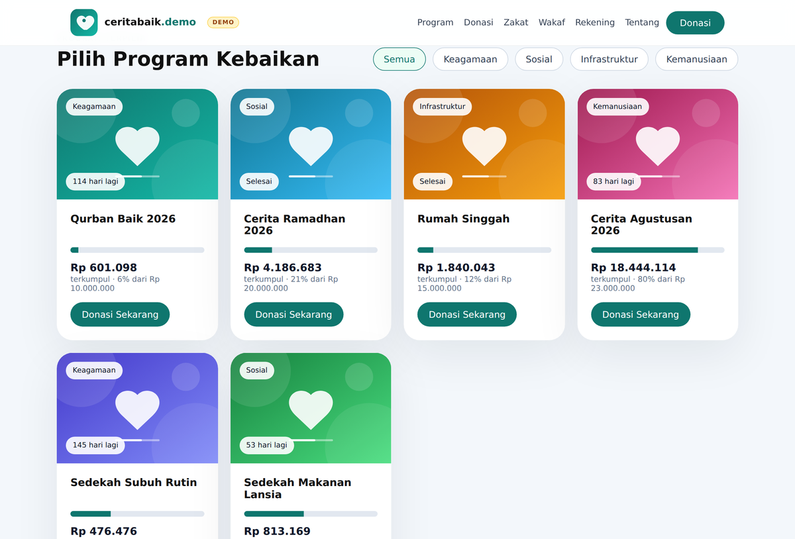
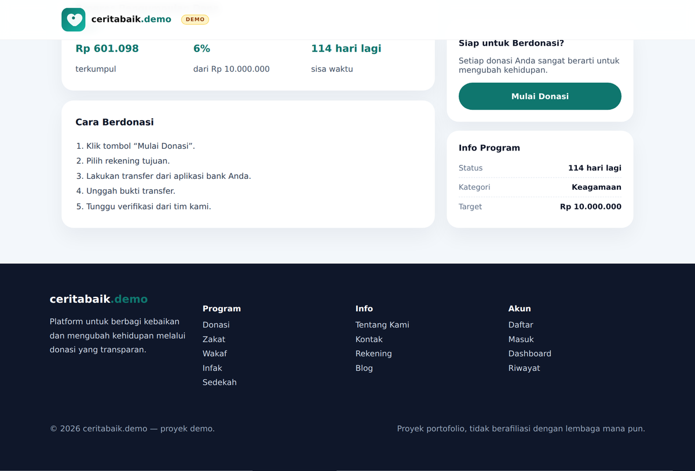
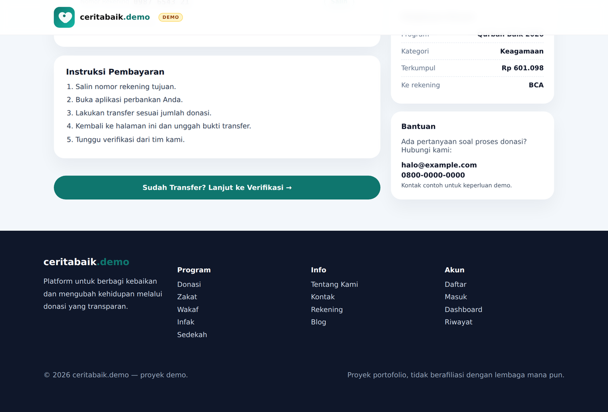
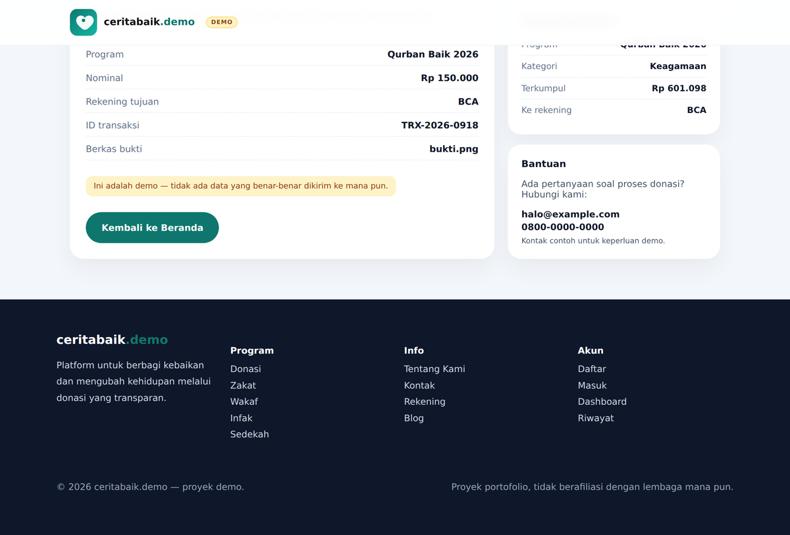
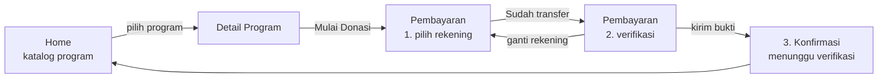

# CeritaBaik — Donation Platform UI

Rekonstruksi antarmuka platform donasi (crowdfunding sosial) dengan React + Vite,
lengkap dengan alur donasi tiga langkah: pilih rekening transfer → unggah bukti →
konfirmasi.

<p>
  
  
  
  
</p>

> **Disclaimer.** Proyek ini adalah latihan/portofolio pribadi dan **tidak berafiliasi**
> dengan yayasan atau lembaga mana pun. Seluruh data program, nominal, nomor rekening,
> email, dan nomor telepon di dalamnya adalah **data contoh** untuk keperluan demo UI.
> Jangan gunakan untuk menerima donasi sungguhan.



---

## Daftar Isi

- [Tentang Proyek](#tentang-proyek)
- [Fitur](#fitur)
- [Tampilan](#tampilan)
- [Alur Aplikasi](#alur-aplikasi)
- [Tech Stack](#tech-stack)
- [Struktur Proyek](#struktur-proyek)
- [Menjalankan Secara Lokal](#menjalankan-secara-lokal)
- [Catatan Teknis](#catatan-teknis)
- [Dua Mode Branding](#dua-mode-branding)
- [Roadmap](#roadmap)
- [Lisensi](#lisensi)

---

## Tentang Proyek

Tujuan proyek ini adalah membangun ulang pengalaman donasi online dari sisi frontend:
dari katalog program, detail program, sampai pembayaran manual (transfer bank +
verifikasi bukti) — pola yang umum dipakai platform galang dana di Indonesia yang
belum memakai payment gateway.

Fokus latihannya:

1. **Memecah satu file besar menjadi struktur yang bisa dirawat.** Versi awal ditulis
   sebagai satu komponen monolitik (masih disimpan di `docs/prototype/` sebagai
   pembanding), lalu dipisah menjadi `pages/`, `components/`, `config/`, dan `utils/`.
2. **Memisahkan data dari tampilan.** Konten hidup di `src/config/`, angka mentah
   diformat di `src/utils/format.js` — komponen hanya mengurus render.
3. **Merancang alur pembayaran manual yang jelas**, termasuk state antar-langkah,
   pemilihan rekening, validasi form, dan layar konfirmasi.

## Fitur

| Halaman | Rute | Isi |
| --- | --- | --- |
| Home | `/` | Hero, quick links, kartu statistik, katalog program dengan filter kategori, grid kategori, CTA, footer |
| Detail Program | `/campaign/:id` | Ringkasan program, progress penggalangan dana, langkah berdonasi, sidebar info + CTA |
| Pembayaran | `/campaign/:id/payment` | Indikator langkah, pemilihan rekening, instruksi transfer, form verifikasi, layar konfirmasi |
| 404 | `*` | Halaman tidak ditemukan dengan jalan kembali |

Detail yang dikerjakan:

- **Filter kategori dibangun dari data**, jadi tab dan isi katalog tidak pernah
  berbeda — plus *empty state* bila kategori kosong.
- **Format rupiah lewat `Intl.NumberFormat('id-ID')`** dan persentase progres dihitung
  dari `raised / target`, bukan angka yang ditulis manual.
- **Sisa waktu dihitung dari tanggal**, dengan label yang menyesuaikan
  (`18 hari lagi`, `Berakhir hari ini`, `Selesai`).
- **Salin nomor rekening** dengan Clipboard API + fallback untuk browser lama/konteks
  non-HTTPS, dan umpan balik lewat toast — bukan `alert()`.
- **Validasi form** per-field: nama, nominal minimal, ID transaksi, serta tipe dan
  ukuran berkas bukti transfer (maks. 5 MB).
- **Aksesibilitas dasar**: `role="radiogroup"` untuk pilihan rekening, `aria-expanded`
  pada tombol menu, `aria-invalid` pada field bermasalah, `role="progressbar"`
  pada bar progres, dan fokus yang terlihat.
- **Responsif** sampai lebar 390 px, dengan menu hamburger yang menutup sendiri
  saat viewport melebar.
- **Rute tidak valid ditangani**: ID program yang tidak ada dan URL asing menampilkan
  halaman khusus, bukan layar putih.

## Tampilan

| Detail program | Pembayaran | Konfirmasi |
| --- | --- | --- |
|  |  |  |

## Alur Aplikasi



## Tech Stack

| Kebutuhan | Pilihan | Alasan |
| --- | --- | --- |
| UI | React 18 | Komposisi komponen dan state lokal sudah cukup untuk skala ini |
| Build tool | Vite 5 | Dev server cepat, konfigurasi minimal |
| Routing | React Router 7 | Rute bersarang dengan parameter (`/campaign/:id/payment`) |
| Styling | CSS murni (`App.css`) | Tanpa UI kit — kontrol penuh atas desain dan ukuran bundle |
| Aset | Berkas lokal + `import.meta.glob` | Ganti logo/foto cukup dengan menimpa berkas, tanpa menyunting kode |

## Struktur Proyek

```
src/
├── main.jsx                     # Entry point, memasang BrowserRouter
├── App.jsx                      # Definisi rute + halaman 404
├── App.css                      # Seluruh style aplikasi
├── components/
│   ├── Navbar.jsx               # Navigasi bersama (varian penuh & ringkas)
│   ├── Footer.jsx               # Footer bersama
│   ├── DemoBanner.jsx           # Pita penanda "ini demo"
│   ├── Toast.jsx                # Notifikasi ringan pengganti alert()
│   ├── CampaignCard.jsx         # Kartu program + progress bar
│   ├── BankAccountSelector.jsx  # Pilihan rekening + salin nomor
│   └── PaymentVerification.jsx  # Form unggah bukti transfer + validasi
├── pages/
│   ├── Home.jsx                 # Landing page
│   ├── CampaignDetail.jsx       # Detail satu program
│   └── Payment.jsx              # Alur pembayaran tiga langkah
├── assets/brand/                # Logo & sampul program — satu-satunya folder aset merek
├── config/
│   ├── brand.js                 # Profil merek per mode + pemuatan aset via glob
│   ├── campaigns.js             # Data program, kategori, statistik, nav, footer
│   ├── payment.js               # Rekening per program, metode & batas unggahan
│   └── constants.js             # Rute & instruksi transfer (meneruskan brand.js)
└── utils/
    └── format.js                # Format rupiah, persentase, label sisa waktu

docs/prototype/ceritabaik.jsx    # Versi awal (satu file) — arsip, tidak ikut build
```

## Menjalankan Secara Lokal

Butuh **Node.js 18+** dan npm.

```bash
git clone https://github.com/<username>/<nama-repo>.git
cd <nama-repo>
npm install
npm run dev          # http://localhost:5173
```

Perintah lain:

```bash
npm run build        # build produksi ke folder dist/
npm run preview      # pratinjau hasil build
```

> Aplikasi memakai `BrowserRouter`. Saat di-deploy ke static hosting, arahkan semua
> rute ke `index.html` (mis. `_redirects` di Netlify, `vercel.json` di Vercel, atau
> `404.html` untuk GitHub Pages) agar refresh di `/campaign/1` tidak menghasilkan 404.

## Catatan Teknis

**Data terpisah dari komponen.** `src/config/` berperan sebagai lapisan data
sementara. Ketika backend siap, cukup ganti impor statis dengan pemanggilan API —
bentuk objek program dan rekening sudah menyerupai payload JSON.

**Angka disimpan sebagai angka.** `raised` dan `target` berupa number; format rupiah
dan persentase dihitung saat render. Mengubah target tidak perlu menyunting teks
progres di beberapa tempat.

**Alur pembayaran sebagai state machine sederhana.** `Payment.jsx` menyimpan satu
state `step` (`account` → `verify` → `done`) sehingga ketiga langkah berbagi konteks
program dan rekening terpilih tanpa rute terpisah atau state global.

**Rekening per program.** `BANK_ACCOUNTS` dipetakan berdasarkan ID program, jadi tiap
program bisa punya satu atau beberapa rekening tujuan tanpa mengubah komponen.

**Belum ada backend.** Submit verifikasi mensimulasikan keberhasilan lalu menampilkan
ringkasan; titik integrasi API ditandai komentar `TODO: BACKEND` di
`src/pages/Payment.jsx`.

## Dua Mode Branding

Repo ini punya dua wajah, dan keduanya berbagi kode yang **persis sama**:

| Branch | Mode | Dipakai untuk |
| --- | --- | --- |
| `main` | `demo` | Portofolio publik — aset placeholder, pita penanda demo aktif |
| `client` | `client` | Branding penuh — logo & foto asli, penanda demo mati |

Yang membedakan hanya dua hal: berkas `.env` dan isi `src/assets/brand/`. Tidak ada
satu pun file `.jsx` yang berbeda, jadi `git merge main` ke `client` tidak pernah
menimbulkan konflik di kode.

```bash
# .env pada branch client
VITE_BRAND_MODE=client
VITE_BRAND_EMAIL=...
VITE_BRAND_PHONE=...
```

Mengganti aset **tidak perlu menyunting kode**. `src/config/brand.js` memuat berkas
lewat `import.meta.glob`, jadi cukup letakkan berkas dengan penamaan berikut —
ekstensi bebas (`svg`, `png`, `jpg`, `webp`, `avif`):

```
src/assets/brand/
├── logo.(svg|png|…)
└── cover-1.(jpg|png|…) … cover-6.(jpg|png|…)
```

> **Rekening.** Setiap entri di `src/config/payment.js` bertanda `placeholder: true`.
> Selama tanda itu ada, halaman pembayaran menampilkan peringatan bahwa nomornya
> masih data contoh. Hapus tandanya hanya setelah nomor rekening asli dimasukkan —
> ini yang mencegah nomor karangan ikut tayang di situs donasi sungguhan.

## Roadmap

- [ ] Integrasi API: submit verifikasi, daftar program, dan status donasi
- [ ] Halaman admin untuk memverifikasi bukti transfer masuk
- [ ] Pratinjau gambar bukti transfer sebelum dikirim
- [ ] Pencarian & pengurutan program (terbaru, paling mendekati target)
- [ ] Pengujian komponen dengan Vitest + Testing Library
- [ ] ESLint + Prettier dan pipeline CI sederhana
- [ ] Deploy demo publik (Vercel/Netlify)

## Lisensi

[MIT](LICENSE) — silakan pakai sebagai referensi belajar.

---

Dibuat oleh **Al Adiyat** — backend-leaning fullstack developer, Bandung.
